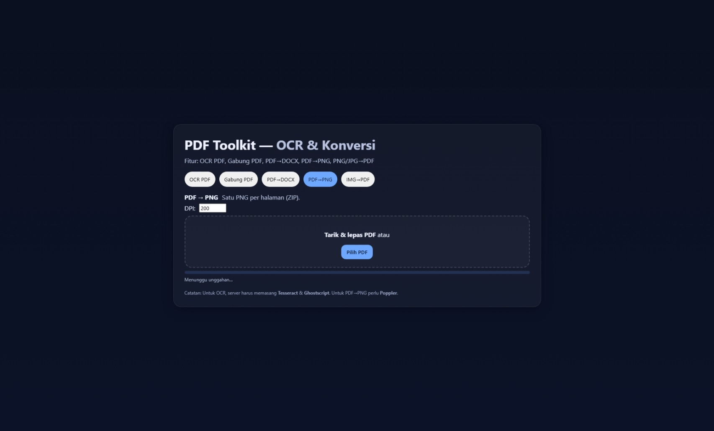

# 📄 PDF Toolkit — OCR & Konversi

<div align="center">
  
  Aplikasi web sederhana berbasis **Flask** untuk mengelola dan mengonversi file PDF maupun gambar.  
  Mendukung berbagai fitur praktis yang dapat digunakan langsung melalui browser.

  
</div>

---

## ✨ Fitur Utama

| Fitur             | Deskripsi |
|-------------------|-----------|
| **OCR PDF**       | Mengubah PDF hasil scan menjadi **PDF yang dapat dicari teksnya** (searchable PDF) menggunakan [Tesseract OCR](https://github.com/tesseract-ocr/tesseract). |
| **Gabung PDF**    | Menggabungkan beberapa file PDF menjadi satu file PDF. |
| **PDF → DOCX**    | Mengonversi PDF berbasis teks menjadi dokumen Microsoft Word `.docx`. |
| **PNG/JPG → PDF** | Menggabungkan satu atau banyak gambar menjadi satu file PDF. |
| **PDF → PNG**     | Mengubah setiap halaman PDF menjadi gambar PNG, kemudian mengemasnya dalam file ZIP. |

---

## 📦 Instalasi

### 1. Clone Repository
```bash
git clone https://github.com/zzkydev/Convertify-PDF.git
cd Convertify-PDF
```

### 2. (Opsional) Buat Virtual Environment
```bash
python -m venv .venv

# Aktifkan venv
# Windows
.venv\Scripts\activate

# macOS / Linux
source .venv/bin/activate
```

### 3. Install Dependensi Python
```bash
pip install -r requirements.txt
```

### 4. Install Dependensi Sistem

#### Ubuntu/Debian
```bash
sudo apt update
sudo apt install tesseract-ocr ghostscript poppler-utils
```

#### macOS (Homebrew)
```bash
brew install tesseract ghostscript poppler
```

#### Windows
- Install [Tesseract OCR](https://github.com/UB-Mannheim/tesseract/wiki)
- Install [Ghostscript](https://www.ghostscript.com/download/gsdnld.html)
- Install [Poppler for Windows](https://blog.alivate.com.au/poppler-windows/)

Pastikan folder `bin` dari masing-masing aplikasi ditambahkan ke `PATH`.

---

## ▶️ Menjalankan Aplikasi

```bash
python app.py
```

Buka browser dan akses:
```
http://localhost:5000
```

---

## 📂 Panduan Penggunaan

Aplikasi ini memiliki tampilan web yang terdiri dari beberapa tab, masing-masing untuk fitur yang berbeda.

### 1. OCR PDF
1. Pilih tab **OCR PDF**.
2. Masukkan bahasa OCR (contoh: `eng` untuk Inggris, `eng+ind` untuk Inggris & Indonesia).
3. Unggah file PDF hasil scan.
4. Setelah proses selesai, file PDF hasil OCR akan otomatis terunduh.

### 2. Gabung PDF
1. Pilih tab **Gabung PDF**.
2. Unggah beberapa file PDF.
3. File gabungan akan otomatis diunduh.

### 3. PDF → DOCX
1. Pilih tab **PDF→DOCX**.
2. Unggah file PDF berbasis teks.
3. File `.docx` hasil konversi akan otomatis terunduh.

### 4. PNG/JPG → PDF
1. Pilih tab **IMG→PDF**.
2. Unggah satu atau beberapa gambar.
3. Semua gambar akan digabung menjadi satu PDF.

### 5. PDF → PNG
1. Pilih tab **PDF→PNG**.
2. Atur DPI (default: 200).
3. Unggah file PDF.
4. Hasilnya berupa file ZIP berisi PNG per halaman.

---

## 🔗 Endpoint API (Opsional untuk Pengembang)

| Endpoint | Metode | Deskripsi |
|----------|--------|-----------|
| `/api/ocr/pdf` | POST | OCR PDF → PDF searchable (`lang` opsional, contoh `eng+ind`) |
| `/api/merge/pdf` | POST | Gabung beberapa PDF (`files[]` multiple) |
| `/api/convert/pdf-to-docx` | POST | PDF → DOCX |
| `/api/convert/img-to-pdf` | POST | PNG/JPG → PDF (bisa multi-file) |
| `/api/convert/pdf-to-png` | POST | PDF → PNG (ZIP; param `dpi` opsional) |

---

## 📋 Requirements

### Python Dependencies
Buat file `requirements.txt`:
```txt
Flask==2.3.2
PyPDF2==3.0.1
pdf2docx==0.5.6
Pillow==10.0.0
pytesseract==0.3.10
pdf2image==1.16.3
```

### Sistem Requirements
- **Tesseract OCR** - untuk fitur OCR PDF
- **Ghostscript** - untuk processing PDF
- **Poppler** - untuk konversi PDF ke gambar

---

## ⚠️ Catatan Penting

- Fitur **OCR PDF** membutuhkan Tesseract OCR dan Ghostscript terpasang di server.
- Fitur **PDF → PNG** membutuhkan Poppler.
- Proses untuk file besar memerlukan waktu lebih lama.
- Untuk produksi, jalankan dengan `gunicorn`/`uwsgi` di belakang `nginx`, dan nonaktifkan `debug=True` pada `app.py`.

---

## 🚀 Deployment

### Menggunakan Gunicorn (Produksi)
```bash
pip install gunicorn
gunicorn -w 4 -b 0.0.0.0:5000 app:app
```

### Menggunakan Docker
Buat `Dockerfile`:
```dockerfile
FROM python:3.9-slim

# Install sistem dependencies
RUN apt-get update && apt-get install -y \
    tesseract-ocr \
    ghostscript \
    poppler-utils \
    && rm -rf /var/lib/apt/lists/*

WORKDIR /app
COPY requirements.txt .
RUN pip install -r requirements.txt

COPY . .

EXPOSE 5000
CMD ["gunicorn", "-w", "4", "-b", "0.0.0.0:5000", "app:app"]
```

---

## 🤝 Kontribusi

1. Fork repository ini
2. Buat branch fitur baru (`git checkout -b fitur-baru`)
3. Commit perubahan (`git commit -am 'Tambah fitur baru'`)
4. Push ke branch (`git push origin fitur-baru`)
5. Buat Pull Request

---

## 📜 Lisensi

Proyek ini menggunakan lisensi **MIT** — bebas digunakan, dimodifikasi, dan didistribusikan.

---

## 📞 Dukungan

Jika Anda mengalami masalah atau memiliki pertanyaan:
- Buat [Issue](https://github.com/zzkydev/Convertify-PDF/issues) di GitHub
- Email: admin@zakk.my.id

---

**Dibuat dengan ❤️ menggunakan Flask dan Python**
